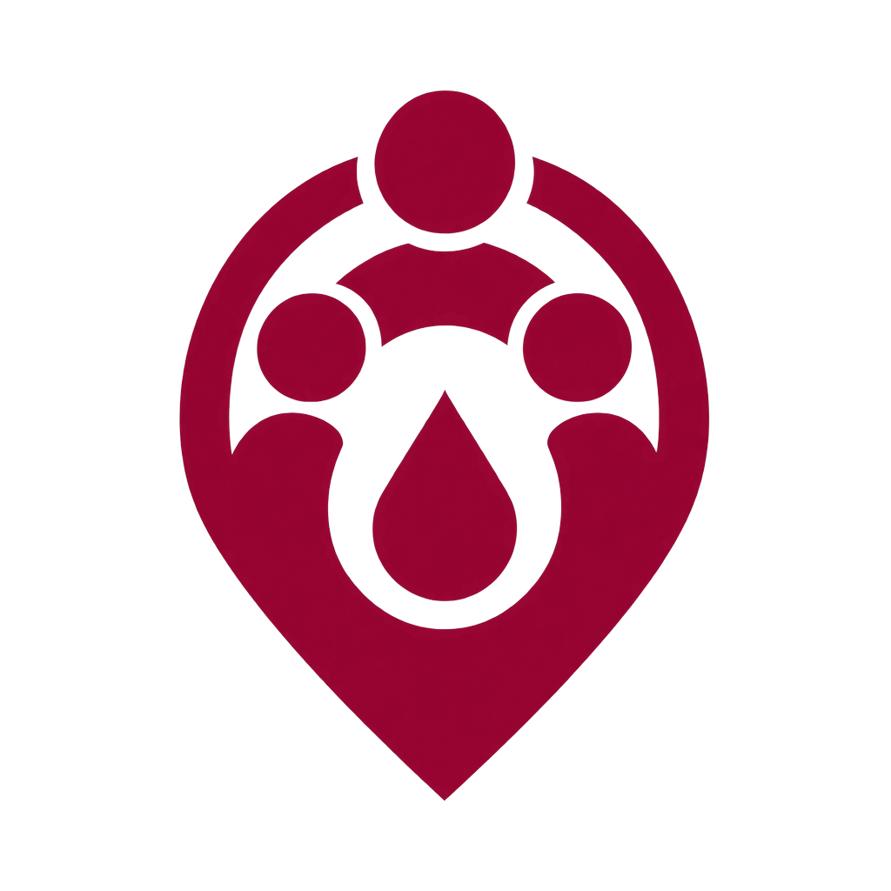
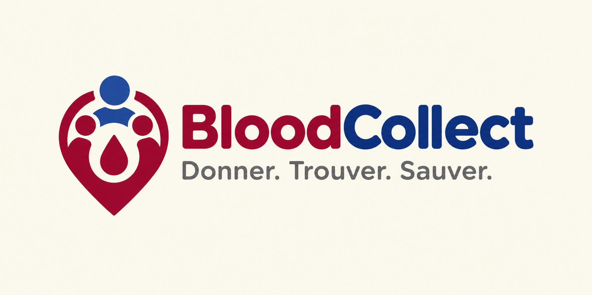

<p align="center">
  
</p>

<h1 align="center">BloodCollect</h1>
<p align="center"><strong>Donner. Trouver. Sauver.</strong></p>

<p align="center">
  
  
  
  
</p>

## Le problème

Quand un besoin transfusionnel survient, savoir vite où trouver du sang compatible est difficile : infos éparpillées entre centres, mobilisation de donneurs par appels en chaîne. Chaque minute compte.

## La solution

BloodCollect est une couche numérique de coordination qui relie dans un seul parcours le besoin, les stocks déclarés des structures autorisées et la mobilisation de donneurs potentiels.

**Blood Route**, le mécanisme central :

```
Besoin → recherche stock déclaré → orientation → mobilisation donneurs (5 → 10 → 20 km) → suivi réponses
```

> **Règle fondamentale : un donneur n'est PAS du sang disponible.**
> Le don et sa validation se font toujours en centre agréé.
> D'où le code visuel : **bleu `#1E3A8A` = personnes**, **rouge `#9F1239` = sang**, fond ivoire `#F6F2EC`.

## Rôles

| Citoyen / Donneur | Centre de santé | Centre de transfusion |
|---|---|---|
| Inscription libre, compte actif immédiat | Compte vérifié avant activation | Compte vérifié avant activation |
| Chercher un donneur, voir la dispo sang (lecture seule), don volontaire, campagnes | Seul rôle qui peut **demander** du sang, suivi temps réel `Transmise → Reçue → En cours → Décision` | Stocks par lots, file de demandes (4 décisions : approuver / partiel / refuser / orienter), collectes géo-notifiées |
| 5 onglets : Accueil, Donneurs, Sang, Donner, Profil | 5 onglets : Accueil, Donneurs, Sang, Demandes, Profil | 5 onglets : Accueil, Stocks, Demandes, Collectes, Profil |

Un 4e acteur, **admin**, valide les dossiers des structures (`pending → verified / rejected`).

## Logo

| Usage | Fichier |
|---|---|
| Couleur / header / print | `assets/logo/logo_red.png` |
| Splash fond rouge + foreground adaptive icon | `assets/logo/logo_white.png` / `fg_white_432.png` |
| Petites tailles, favicon, marker map | `assets/logo/logo_simplified.png` |
| Icône legacy opaque | `assets/logo/icon.png` |
| Lockup horizontal + slogan (README, affiches) | `assets/logo/source/lockup_source.png` |

<p align="center">
  
</p>

Tous les chemins sont centralisés dans `lib/core/constants/app_assets.dart` (`AppAssets.logoWhite`, …).

## État du MVP

**Fait :** thème Material 3, navigation multi-rôle `go_router` 3× `StatefulShellRoute`, `RouterNotifier` avec redirection par rôle, providers auth (`authState` + `currentUserRole`), splash avec logo, 14 énumérations, 11 entités + 11 models Firestore, launcher icons Android/iOS.

**Mock :** les 15 écrans métiers sont des `PlaceholderScreen`, `login` / `register` à implémenter, pas encore de repositories, FCM / Cloud Functions à venir (`onBloodRequestCreated`, `onStockUpdated`, `onCampaignPublished`).

## Stack technique

Flutter 3 · `firebase_core/auth/firestore/storage/messaging/functions/analytics/app_check` · `flutter_riverpod` 3 + `@riverpod` · `go_router` 18 · `build_runner` + `riverpod_generator` · `flutter_launcher_icons`.

Architecture **Clean + feature-first par rôle** :

```
lib/
  main.dart                    # Firebase.init + ProviderScope + MaterialApp.router
  core/constants/              # app_colors, app_enums (14), app_assets, firestore_collections
  core/theme/                  # AppTheme Material 3
  core/router/                 # app_router (18 routes) + RouterNotifier
  core/widgets/                # placeholder_screen
  features/auth/               # splash, login, register + providers
  features/citizen/            # shell 5 onglets
  features/health_center/      # shell 5 onglets
  features/blood_center/       # shell 5 onglets
  shared/domain/entities/      # 11 entités pures (DateTime, GeoLocation, copyWith)
  shared/data/models/          # 11 models fromMap/toMap (Timestamp, GeoPoint)
```

## Modèle Firestore (Spec v1.0)

11 collections : `users`, `health_centers`, `blood_centers`, `blood_stock_lots`, `blood_requests`, `donor_match_requests`, `campaigns`, `campaign_registrations`, `donations`, `validation_requests`, `notifications`.

14 énumérations : `UserRole`, `BloodType`, `ProductType`, `Priority`, `VerificationStatus`, `StockLotStatus`, `RequestStatus`, `BloodRouteStep`, `DonorMatchStatus`, `CampaignStatus`, `RegistrationStatus`, `DonationStatus`, `NotificationType`, `StructureType` — valeurs `snake_case` via `firestoreValue` / `fromString`.

Détail champ par champ : voir le PDF `BloodCollect_Models_Specification` dans le dossier de cadrage.

## Démarrage dev

```bash
flutter pub get
dart run build_runner build --delete-conflicting-outputs
# configure Firebase (génère lib/firebase_options.dart + google-services.json)
dart run flutter_launcher_icons   # régénère les icônes depuis assets/logo/icon.png
flutter run
```

Projet Firebase : `bloodcollect-be2ac`.

## Roadmap

1. Auth complète + formulaires différenciés par rôle + `AuthRepository`
2. Repositories / datasources Firestore sur les 11 models
3. Écrans Citoyen (5) puis Santé (5) puis Transfusion (5)
4. FCM + Cloud Functions + règles Firestore + Storage justificatifs
5. Tableaux de bord + indicateurs (temps demande → solution, taux de réponse, campagnes)

## Limites

Pas de diagnostic, pas de compatibilité transfusionnelle automatique, pas de dossiers médicaux : le groupe déclaré sert à la mobilisation et est vérifié en centre agréé. Données minimales : donneurs anonymisés (groupe + commune + distance), patient = seule ref `DOS-XXXX`, coordonnées partagées après acceptation uniquement.

ODD 3 (santé) principal, ODD 10 (inégalités) secondaire.

---

*FlutterFire Summer Camp 2026 — document de travail, version de cadrage.*
