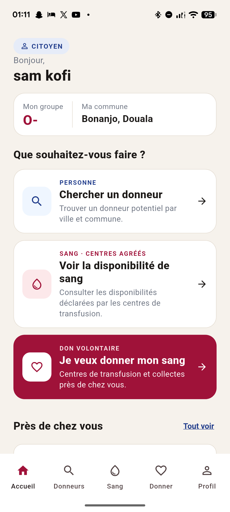
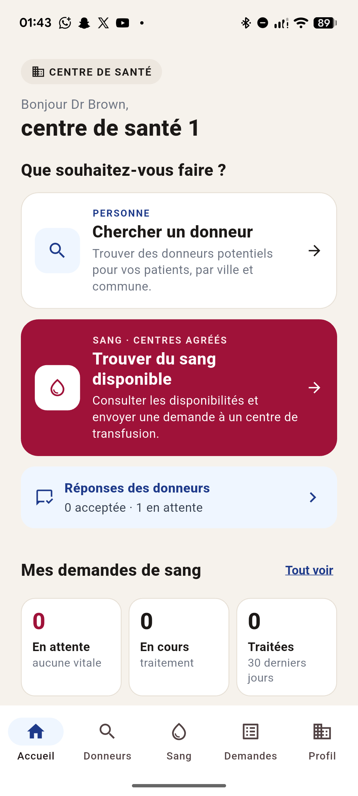
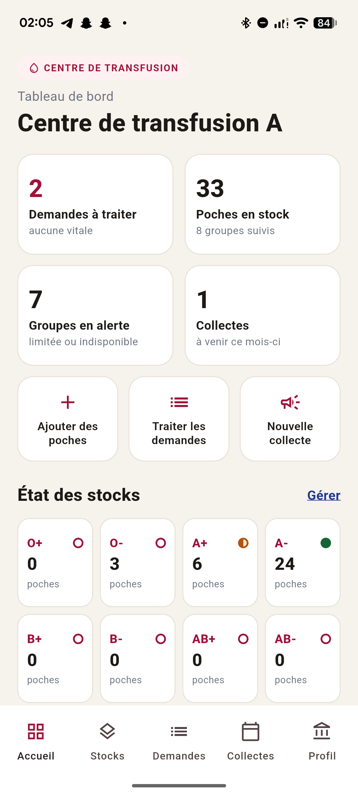

<p align="center">
  
</p>

<h1 align="center">BloodCollect</h1>
<p align="center"><strong>Donner. Trouver. Sauver.</strong></p>

<p align="center">
  
  
  
  
</p>

<p align="center">
  
</p>

---

5,2 familles sur 10 n'ont pas accès au sang quand elles en ont besoin. 196 000 vies perdues chaque année — non par manque de donneurs, mais par manque de connexion entre ceux qui donnent et ceux qui reçoivent.

**BloodCollect crée ce lien.** Une application qui coordonne en temps réel les citoyens qui veulent donner, les hôpitaux qui en ont besoin, et les centres de transfusion qui gèrent les stocks.

---

## Aperçu

<p align="center">
  
  &nbsp;&nbsp;
  
  &nbsp;&nbsp;
  
</p>

<p align="center">
  <em>Citoyen &nbsp;·&nbsp; Centre de santé &nbsp;·&nbsp; Centre de transfusion</em>
</p>

---

## Comment ça marche

BloodCollect repose sur **3 rôles**, chacun avec sa propre interface :

**🧑 Citoyen**
Cherche un donneur compatible près de lui, consulte la disponibilité de sang dans les centres agréés, et s'inscrit pour donner son sang lors de campagnes de collecte.

**🏥 Centre de santé**
Signale une urgence transfusionnelle en quelques secondes. La demande est transmise aux centres de transfusion et les donneurs potentiels sont mobilisés par rayon géographique (5 → 10 → 20 km).

**🩸 Centre de transfusion**
Gère ses stocks par groupe sanguin, traite les demandes entrantes (approuver / partiel / refuser / orienter), et organise des collectes géolocalisées.

> Un donneur n'est PAS du sang disponible. Le don et sa validation se font toujours en centre agréé.

---

## Stack technique

Flutter 3 · Firebase (Auth, Firestore, Storage, Messaging, Functions, Analytics) · Riverpod 3 · go_router 18 · Clean Architecture feature-first par rôle

---

## Démarrage

```bash
flutter pub get
dart run build_runner build --delete-conflicting-outputs
flutter run
```

Projet Firebase : `bloodcollect-be2ac`

---

## Objectifs de Développement Durable

Ce projet s'inscrit dans les priorités mondiales :
- **ODD 3** — Bonne santé et bien-être
- **ODD 10** — Réduction des inégalités
- **ODD 17** — Partenariats pour la réalisation des objectifs

---

## Équipe

Soumission pour le **FlutterFire Summer Camp 2026**

Cameroun 🇨🇲 · Côte d'Ivoire 🇨🇮 · Bénin 🇧🇯 · Niger 🇳🇪
